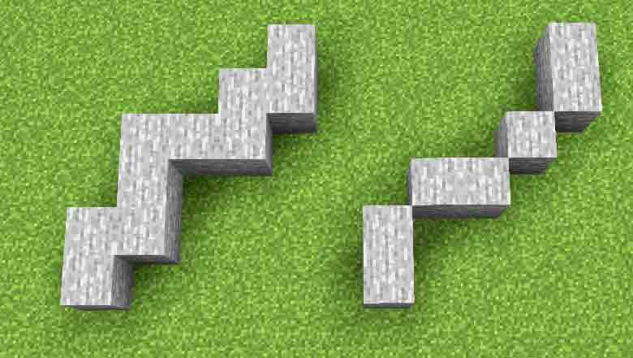
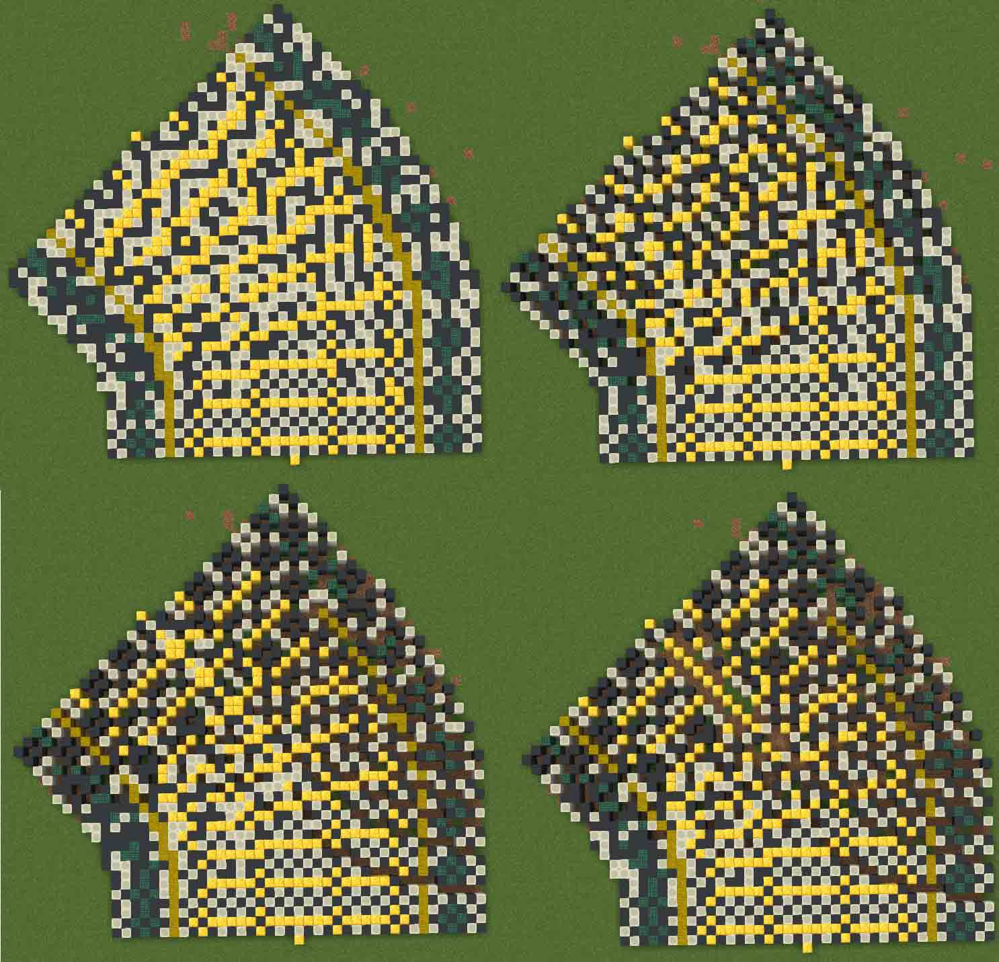
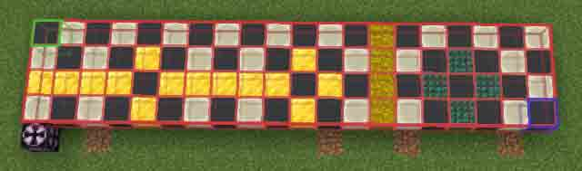
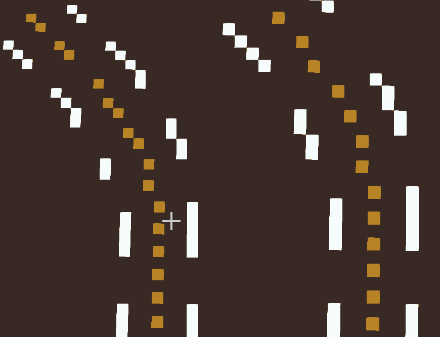
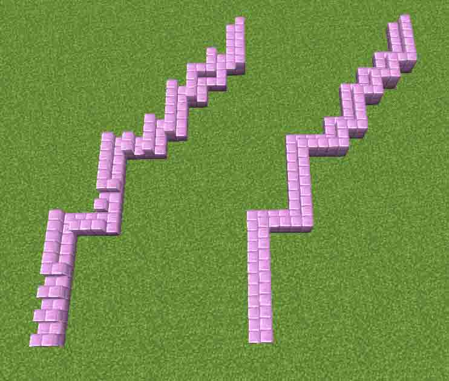

一些用于Minecraft插件World Edit的craftscript脚本。
请将这些*.js脚本文件放置在WorldEdit插件的craftscripts文件夹下（可以只复制您需要的脚本，脚本之间互不影响）。如果找不到WorldEdit插件安装位置，可以随便输入`/cs xxx`运行一个脚本，WE会告诉你在某个目录下找不到xxx.js文件从而获得目录位置。
## roadbuilder文件夹
roadbuilder文件夹中的脚本是一些曲线道路的生成器与辅助脚本。
### 术语介绍
- 含拐角曲线：曲线上的每个拐角均通过直角邻边连接；
- 不含拐角曲线：曲线上的每个拐角均仅通过斜角连接；
- 方块距离：认为共边相邻方块与对角相邻方块之间的距离都是1；
- 几何距离：严格按照几何上的勾股定理计算斜边距离；

含拐角曲线（左）与不含拐角曲线（右）
### fix.js
检测玩家脚下方块连成的曲线（通过同一材质识别），将其修复为含拐角曲线。
用法：站在待修复曲线的一端，执行`/cs fix`。
附加参数：若想指定修复曲线拐点方块在哪一侧添加，则加入参数`l`（左侧）或`r`（右侧）。如在曲线右侧添加，则需要输入`/cs fix r`。
### edge.js
检测玩家脚下方块区域（通过同一材质识别）的左/右边缘。将边缘用指定材料方块勾勒出。
用法：站在区域边缘执行`/cs edge <指定材料> l`或`/cs edge <指定材料> r`分别将区域的左或右边界以含拐角曲线勾勒出。
执行`/cs edge <指定材料> lc`或`/cs edge <指定材料> rc`使用不含拐角曲线勾勒。
注：区域可以是含拐角曲线，但不能是不含拐角曲线，因为不含拐角曲线上的每个拐角均仅通过斜角连接，不算做连续的区域。
### loft.js
检测玩家脚下方块连成的曲线（通过同一材质识别，含不含拐角均可），使用给定的道路模板对该曲线进行放样，类似于直线上使用`//stack`的效果。
脚本有自带的道路模板，也可以通过玩家的选区指定。其中玩家的选区指定有以下四种放样模式：
- s 模式：放样采用默认的插值方式，适合放样较宽大的图形，但可能丢失细节。
- ls 模式：放样采用路径方向插值，横向不插值的方式，适合放样沿路径的线条，能够保持线条在不同角度下的宽度始终为一个像素。
- ss 模式：放样采用路径方向不插值，横向插值的方式，适合放样路径上横向的线条，能够保持线条在不同角度下的宽度始终为一个像素。
- ps 模式：无任何插值，将模板中的每个方块沿着路径做阵列，即保证任何位置的方块长度与宽度均为一个像素。

玩家需要创造一条直道路片段模板并用长方体选区包围。并且长方体选区的四个面外侧应该有且仅有一个结构方块（只能使用`/give @p minecraft:structure_block`命令获得）用于定位放样的方向与中心线的位置。

用法：站在曲线端点执行`/cs loft <模板>`即可（如`/cs loft ss`）。
附加参数说明：`/cs loft <模板> [开始:结束] [-ns] [-n1] [-nf]`
- `[开始:结束]`：仅对曲线上某一段进行放样，其中开始与结束位置使用从首端开始沿曲线的方块距离计算，若开始与结尾为曲线端点则可以省略数字不写，例如对曲线上第20-30段放样：`/cs loft <模板> 20:30`、对曲线上第20-末尾段放样：`/cs loft <模板> 20:`
- `[-ns]`：默认的道路模板为对称模板，仅需建立一侧模板，若需配置费对称模板，需要加`-ns`参数。如`/cs loft ss -ns`
- `[-n1]`：道路模板放样是图案沿线的变化默认通过计算几何距离得到，若想使用方块距离则需添加该参数，如`/cs loft ss :50 -n1 -ns`采用非对称、方块距离使用玩家指定的选区对玩家脚下的曲线前50个方块放样，且采用路径方向不插值、路径横向插值的方式。
- `[-nf]`：放样后默认对能连接的栅栏与玻璃板做连接修复，若不希望修复，则需要加`-nf`参数。

注：
1. 模板将自动忽略空气方块，若想强制在放样时让空气方块覆盖原有方块，请在相应位置放置结构空位方块（只能使用`/give @p minecraft:structure_void`命令获得）。
2. 对于较大的模板，该放样脚本的执行速率会很慢，一直与超出了WorldEdit默认设置的脚本执行最长等待时间（默认3000ms），以至于脚本到时间后自动停止，执行失败。您可以减少放样方块数分多次放样，或将WorldEdit设置（与craftscripts文件夹同目录的文件worldedit.properties）中的scripting-timeout项更改为更长时间（如20000ms）。
3. 虽然可以选择不同插值方法，但通过脚本自动生成的道路往往还有很多瑕疵需手动修复，不要过度依赖自动化，一分耕耘，一分收获。

### stair.js
楼梯连接朝向修复工具。检测玩家脚下方块连成的含拐角曲线（通过同一材质识别），该曲线材质必须是某种楼梯，否则执行代码将报错。默认楼梯朝向路径的左侧。用法：`\cs stair`。

### rail.js
mc原版铁路修复工具。可自动铺动力铁轨与探测铁轨。检测玩家脚下方块连成的含拐角曲线（通过同一材质识别），并在该曲线上铺设铁轨。默认命令`\cs rail`在直轨上生成动力铁轨，若需要添加探测铁轨，且该铁路为前向单行线路，则使用命令`\cs rail f`，后向单行线路则使用命令`\cs rail b`，双向则为`\cs rail fb`。若只想要普通铁轨，请使用`\cs rail n`命令。

## sphere文件夹
sphere文件夹中的脚本是一些球形生成器。该文件夹与道路生成无关。
### Earth.js
根据圆柱投影的世界地图图片生成地球图案。
用法：先创建一个任意材质的空心球体(如使用指令`//hsphere`)然后在球心处执行
`/cs earth <地球图片> <刚才创建的空心球的材质> <空心球半径>`
地球图片文件需要放在.minecraft/drawings/目录中
至于为什么先要创建空心球是因为怕我自己栅格化生成的球跟WE自己生成的算法不一样导致不匹配，我也懒得再写第二个版本，就这样将就用吧。
如果要换其他图片，具体地球图片的颜色处理必须要自行修改源码中的调色板（clothColors与clothBlocks）。推荐先在PS里把图片颜色阈值化。

### 6rings.js
生成一个基于截半二十面体结构的6个大环框架。
用法：在球心处直接执行
`/cs 6ring <棱材质> <顶点材质> <半径> <棱宽>`
其中棱材质就是环形材质，顶点材质是两个环相交部位的材质，棱宽一般无论半径大小都取0.2左右，它是棱宽球面距离角度的正弦值，不是绝对宽度。